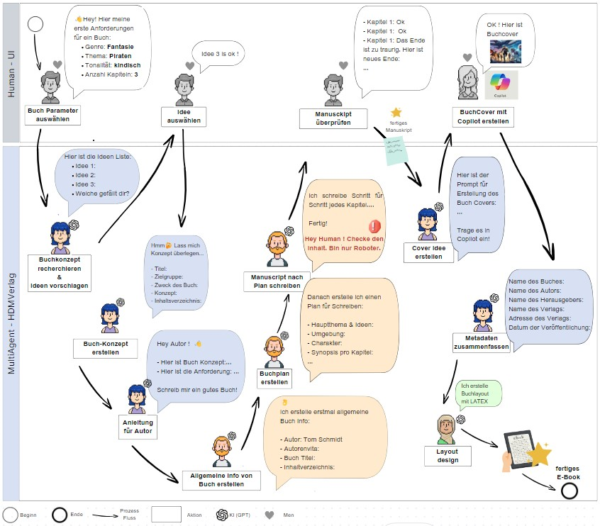

# HUMAN AI PROJECT: E-BOOK 

**Roles & Tasks**:

**SOP**:

## Installation Guide:

### Backend (MetaGPT):

**File: matagpt yalm**

model: "gpt-4o"

**File: writeLatex.py**

output_dir = "C:/Users/admin/PycharmProjects/HumanAI/workspace/Ebook_Latex/out"

(define location for PDF Output)

### Frontend:

## User Guide:

[User_Guide.pdf](User_Guide.pdf)
